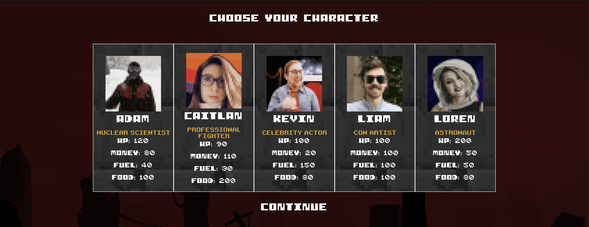

# The Long Way:

It’s been five years since the cataclysm. You’ve been etching out a living in what remains of Sacramento, CA. The landscape of skyscrapers and towering structures has been reduced to smoldering piles of rubble from the near daily earthquakes. The time to journey east is now.
	You’ve been modifying an old Ford truck to make the journey, welding on armor and siphoning what gas you can. Before the signal died out last year, you picked up a radio signal repeating the message: “Washington D.C., is the last remaining safe zone. For anyone listening, if you can make it here, we can help you.”
	You could hit the road now or make one last stop at Old Pete’s to buy additional supplies. What will it be?
1.	Leave
2.	You decided to visit Old Pete’s one last time to see what he has that might be useful for the long journey east.

# Packages Used: 
	*React
	*Axios
	*Cookie-Parser
	*Express
	*Mongoose
	
# How to Run App:
Login or sign-up to create a profile and save your progress if you decided to leave before the game is complete.
Select a player from the player board, then continue on through the multiple-choice game.
Each selection will have either a negative, positive or neutral effect on the player.	

# Team
•	Adam Jeske
•	Caitlan Jeffrey
•	Kevin Adamski
•	Liam Heckman
•	Loren Kolstad

# Special Thanks
	Thank to our Professor Marcelo Gachet and our TA’s (Austin, Leah, Hoff and Justin) for helping our team succeed with this project! I’d also like to thank my team members! This was project was the most fun and I had an excellent time creating such a fun project! Thank you.
